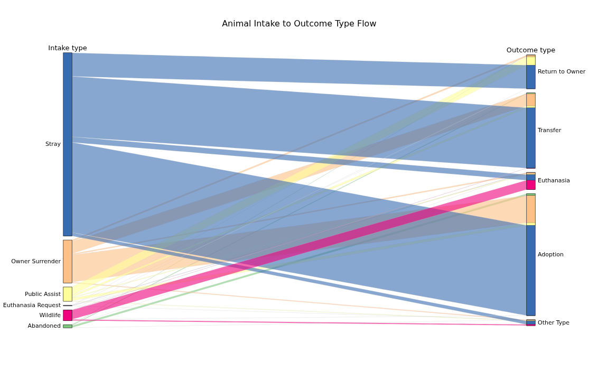

# Austin Animal Shelter Data Analysis



## Overview

This project presents a comprehensive analysis of animal shelter operations using real-world data from **Austin Animal Center** in Austin, Texas (US). The analysis was conducted as part of the **BI-VIZ course at FIT CTU in 2025**.

Data is sourced from the [City of Austin Open Data Portal](https://data.austintexas.gov/).

## Datasets

The analysis focuses on two primary datasets:

- **Intakes** (`intakes.csv`): Records of animals entering the shelter, including information about the circumstances of intake, animal characteristics, and timing
- **Outcomes** (`outcomes.csv`): Records of animals leaving the shelter, including information about outcome types and animal characteristics at the time of departure

Both datasets span from October 2013 to May 2025, covering over 173,000 animal records.

## Impact and Purpose

Through exploratory data analysis and pattern investigation, this project aims to uncover insights that can:

- **Inform shelter operations** - Understanding intake patterns and temporal trends enables better resource allocation and staffing decisions
- **Improve animal outcomes** - Identifying factors that influence adoption success and other positive outcomes helps shelters develop targeted interventions
- **Support evidence-based policy** - Data-driven findings provide a foundation for implementing programs that enhance animal welfare
- **Optimize sterilization programs** - Analyzing the relationship between sterilization status and outcomes demonstrates program effectiveness

The analysis demonstrates how data science techniques can transform raw operational data into actionable insights for animal welfare organizations.

## Analysis Methodology

The analysis progresses through several systematic stages:

1. **Data Overview**: Examination of dataset structure, dimensions, data types, and missing value patterns
2. **Data Cleanup**: Systematic addressing of data quality issues including redundant columns, duplicates, missing values, and type conversions
3. **Feature Analysis**: Examination of individual features to understand shelter population and operational patterns
4. **Feature Relationships**: Investigation of how different variables interact and influence each other
5. **Data to Insights**: Analytical questions and pattern investigations that emerge from the data

## Usage

To explore the analysis:

**Clone the repository:**
```bash
git clone https://github.com/T-im4i-k/austin-animal-shelter-eda.git
cd austin-animal-shelter-eda
```

**Install dependencies:**
```bash
pip install -r requirements.txt
```

**Run the analysis notebook:**
```bash
cd src/
jupyter notebook analysis.ipynb
```

The notebook contains all visualizations, statistical analyses, and detailed findings from the investigation.

## References

**Data Sources:**
- [Austin Animal Center Intakes Dataset](https://data.austintexas.gov/Health-and-Community-Services/Austin-Animal-Center-Intakes-10-01-2013-to-05-05-/wter-evkm/about_data)
- [Austin Animal Center Outcomes Dataset](https://data.austintexas.gov/Health-and-Community-Services/Austin-Animal-Center-Outcomes-10-01-2013-to-05-05-/9t4d-g238/about_data)

**Tools:**
- Analysis conducted using Python with pandas, numpy, matplotlib, seaborn, and plotly libraries

**AI Assistance:**
- Claude Sonnet 4.5 (Anthropic) - Code debugging, documentation refinement, and analytical guidance
- ChatGPT-4 (OpenAI) - Code debugging, documentation refinement, and analytical guidance

---

**Course**: BI-VIZ | **Institution**: FIT CTU | **Year**: 2025

